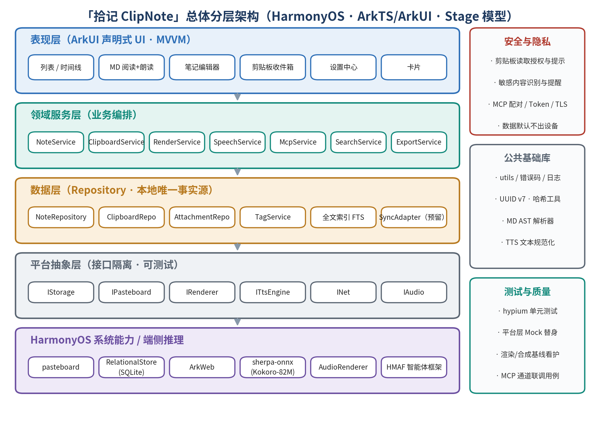
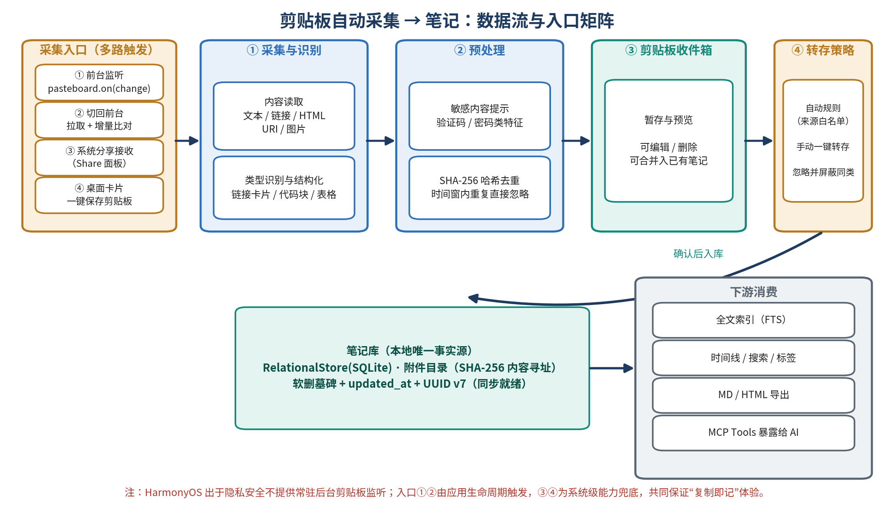
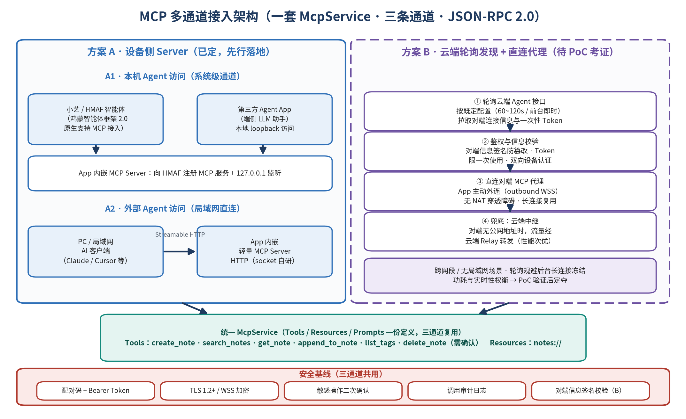
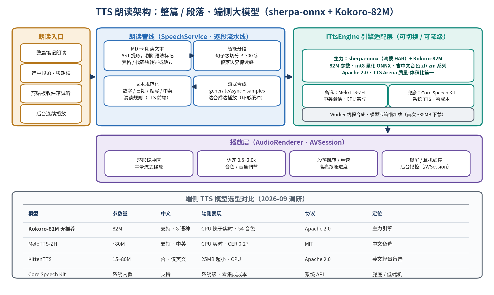
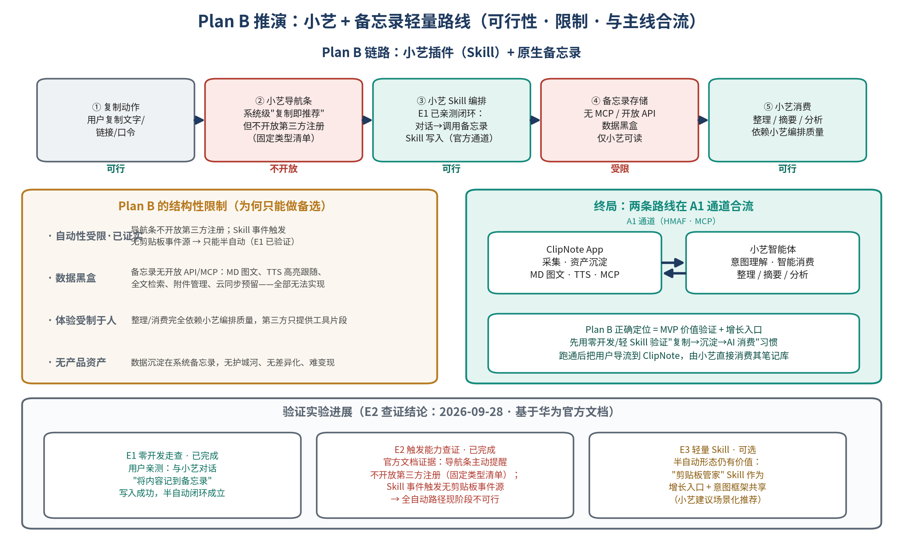
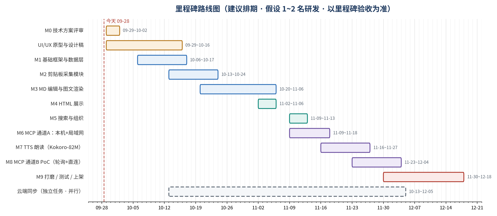

# 「拾记 ClipNote」技术方案设计

> **版本**：V1.4（评审决议刷新）　**日期**：2026-09-28　**状态**：已评审，有条件基线
>
> **V1.4 变更**（采纳两份第三方评审决议，见附录 B 对照表）：  
> ① §1.1 重写采集承诺——删除"自动感知复制即记"，改为"用户授权下的前台采集、分享保存与一键粘贴"；  
> ② §4.5 MCP 重构——补协议版本决策（2026-07-28 规范已实质变更）、A1/A2 降级为待 PoC、方案 B 退出首发关键路径并删除无依据断言、新增工具级授权语义表；  
> ③ §4.2 补附件实体/引用分离、原子写入顺序、恢复扫描与"可读导出 ≠ 可恢复备份"；  
> ④ §4.3 收敛为单一解析入口（markdown-it → DocumentBlock），消除双解析矛盾；  
> ⑤ §4.6 TTS 收紧结论——系统离线引擎先行（TTS-0/1/2 渐进），删除"榜单第一/NPU 可直接开启/零集成成本"等无依据表述，修正管线顺序；  
> ⑥ §7 发布分层 V0.1/V0.2/V0.3 + 验证门槛 G1~G7，重估人日，不再承诺日历日期；  
> ⑦ 全文修复 §5.5/§5.6 断链（→§4.5/§4.6）、§4.8 改"同步预留"、§4.9 补证据要求。
>
> **V1.3 变更**：§4.9 验证实验 E1 真机实测通过（小艺对话写入备忘录闭环成立）；E2 完成官方文档查证——导航条主动提醒不开放第三方注册、Skill 事件触发无剪贴板事件源，Plan B 全自动路径现阶段不可行，定位收敛为"半自动 MVP 验证 + 增长入口"。
>
> **V1.2 变更**：新增 §4.9 Plan B 可行性推演与验证实验设计。
>
> **V1.1 变更**：① 新增 TTS 朗读模块设计；② 重构 MCP 接入架构为双轨设计；③ 里程碑与任务分解同步更新。

---

## 1. 项目背景与目标

### 1.1 一句话定位

一款**鸿蒙优先**的本地笔记应用：**在用户授权与系统允许的运行状态下**，通过前台剪贴板采集、分享接收和一键粘贴保存内容；提供 Markdown 图文阅读、离线朗读与受控 Agent 访问，保留可恢复导出与未来同步接口。

> V1.4 口径变更：不再承诺"自动感知剪贴板内容成记/复制即记"。多入口的作用是**降低保存成本**，不是补回已被覆盖的剪贴板历史。后台、息屏、进程终止状态下**不保证持续采集**，UI 应如实展示该能力边界。

### 1.2 需求清单（按编号排序，优先级见列）

| 编号 | 需求            | 优先级    | 说明                                            |
| -- | ------------- | ------ | --------------------------------------------- |
| R1 | 剪贴板采集（多入口）    | P0     | 用户授权下的前台采集、分享接收与一键粘贴；**不承诺后台持续采集**（§4.1 场景矩阵） |
| R2 | 本地存储          | P0     | 业务记录以关系库（SQLite）为权威，附件 blob 内容寻址并经摘要校验；可恢复备份  |
| R3 | Markdown 图文显示 | P0     | 渲染 + 附件图片管理；单一解析入口                            |
| R4 | HTML 文件显示     | P0     | 受控导入的静态 HTML 展示或调用本地浏览器                       |
| R5 | TTS 朗读        | P1     | 整篇或选中段落朗读；系统离线引擎先行，端侧大模型为增强项                  |
| R6 | MCP 协议支持      | P1     | 一个已验证客户端 + 一个锁定协议版本为交付单位；远程通道后置               |
| R7 | 云同步           | P2（预留） | 仅预留实体版本与接口合同，不提前建完整同步表结构                      |
| R8 | 搜索与组织         | P1     | 全文检索（中文，含 FTS 不可用兜底）、标签、收藏、时间线                |

### 1.3 非目标（Non-goals）

- 一期**不做**云端同步的实现与账号体系（仅预留合同，见 §4.8）；
- 一期**不做**后台常驻剪贴板监听、息屏采集、跨网远程即时访问（远程方案为后续专项，见 §4.5 方案 B）；
- 不做跨平台（Android/iOS）——鸿蒙优先，通过平台抽象层降低未来迁移成本；
- TTS 一期**不做**音色克隆与多情感控制；**不承诺手机 NPU 加速**（CPU 基线先行）；
- 一期**不做**任意网页兼容的 HTML 渲染与脚本执行（仅受控静态 HTML 阅读）。

---

## 2. 总体架构



**架构原则**：本地优先 · 隐私默认不出设备 · 分层与接口隔离（可测试）· 渲染/合成/连接三处引擎均可插拔。

- **表现层**：ArkUI 声明式 UI + MVVM；阅读页内嵌「阅读 + 朗读」一体视图（朗读时**段落级**高亮跟随实际播放进度）。
- **领域服务层**：`NoteService`、`SpeechService`、`AccessPolicy`（授权与审计）与既有服务并列；`McpService` 拆为 `McpAdapter`（协议）+ `TransportAdapter`（传输）——领域逻辑与协议/通道解耦（§4.5）。全部服务无 UI 依赖、可被单测覆盖。
- **数据层**：RelationalStore(SQLite) 为**业务记录权威源**；附件目录内容寻址、摘要校验；索引与渲染缓存可重建；`SyncAdapter` 仅为接口占位（同步预留）。
- **平台抽象层**：`ITtsEngine`、`IAudio`、`INet` 等接口隔离鸿蒙 API 与第三方引擎，Mock 可测。
- **系统能力/端侧推理**：pasteboard、ArkWeb、sherpa-onnx（TTS 端侧推理，**待 TTS-1 PoC**）、AudioRenderer/AVSession、HMAF 鸿蒙智能体框架（**待 G2 PoC**）。

**工程结构**（Stage 模型）：单 HAP（entry）+ HAR 共享库 `common`（数据层/工具/解析器）+ HAR `speech`（TTS）+ HAR `mcp`（协议），功能边界清晰、按 HAR 独立演进。

> **配图勘误（待图形修订，见 §9）**：图01 中 `TagService` 应改为 `TagRepository`（或上移服务层）以保持图文一致；HMAF、Kokoro 应改为虚线 + "待验证"标注；应标出 WebView 与外部 Agent 的信任边界。

---

## 3. 技术选型

| 领域     | 选型                                                                    | 理由                                                                 | 备选                                   |
| ------ | --------------------------------------------------------------------- | ------------------------------------------------------------------ | ------------------------------------ |
| 平台/语言  | HarmonyOS NEXT（API 12+），ArkTS + ArkUI，Stage 模型                        | 项目约束：鸿蒙优先；需分别定义 `minCompatibleVersion` 与 target SDK                | —                                    |
| 本地库    | RelationalStore（SQLite）+ Preferences + 沙箱文件                           | 系统原生、支持 SQL/FTS（FTS 可用性待 G7 探测）                                    | —                                    |
| MD 渲染  | 一期 ArkWeb + **markdown-it 作为唯一语法解析入口**，产出轻量 `DocumentBlock` 块模型（§4.3） | 快速交付 + 消除双解析不一致；ArkUI 原生渲染器为二期选项                                   | 纯 ArkUI 自研渲染                         |
| TTS 推理 | sherpa-onnx（官方鸿蒙 HAR，ohpm 分发，NAPI 桥接 C++；**待 TTS-1 PoC 锁定版本**）        | 官方文档确认鸿蒙 TTS 项目与 Melo/Piper 示例 [S04]                               | 系统 TTS（TTS-0 基线）；MindSpore Lite 自行移植 |
| TTS 模型 | Kokoro-82M 与 MeloTTS-ZH 同为**候选**，以真机实测择一（§4.6）                        | 上游模型卡：Kokoro-82M、Apache 2.0、v1.0 含多语种/音色 [S05]；质量排名与 NPU 支持均无本项目证据 | 系统离线引擎兜底                             |
| 音频播放   | AudioRenderer + 环形缓冲；AVSession 播控（**不等于后台合成资格**，待 G4 验证）              | 系统原生流式播放与锁屏/线控                                                     | —                                    |
| MCP    | **协议版本锁定**（§4.5.1，以目标 Host 实测为准）；一期优先评估成熟 HTTP 库移植，不自研完整 HTTP/TLS 栈   | 移动端无现成 MCP SDK；2026-07-28 规范已实质变更，必须显式选版本 [S01]                    | 桌面伴随桥（备选 PoC）                        |
| 并发     | TaskPool / Worker（MD 解析、TTS 合成、剪贴板管线）                                 | 避免阻塞 UI 线程                                                         | —                                    |
| 测试     | hypium 单测 + UI 测试；平台层 Mock                                            | 接口隔离后可测                                                            | —                                    |

---

## 4. 核心模块设计

### 4.1 剪贴板采集（R1）



**入口 × 生命周期 × 承诺矩阵**（V1.4 新增，替代"共同逼近复制即记"表述）：

| 场景                 | 产品承诺              | 必须验证的边界（G1）                   |
| ------------------ | ----------------- | ----------------------------- |
| ClipNote 前台且具备读取条件 | 感知变化后进入收件箱        | 变化通知与内容读取权限分别验证；处理重复事件        |
| ClipNote 回到前台      | 检查当前可读内容并**提示**保存 | **不是历史补采**；拒绝授权后不得反复打扰        |
| 用户分享文本/图片/文件       | 接收用户选定内容          | 接收入口、MIME、URI 临时授权与复制时机       |
| 用户点桌面卡片            | 打开采集页面，再完成授权读取或粘贴 | 不预设卡片环境直接拥有剪贴板读取权限            |
| 用户点手动粘贴入口          | 明确操作后读取并预览        | 系统粘贴安全控件（PasteButton）适配 [S06] |
| 后台、息屏或进程已终止        | **不保证持续采集**       | UI 显示能力边界；普通定时器不当后台保障         |

**管线**：内容读取 → 类型识别与结构化（链接卡片/代码块/表格）→ **内存中限长与敏感特征判断（落盘前）** → SHA-256 去重（时间窗）→ 收件箱暂存。

**收件箱即数据持久化**（V1.4 口径修正）：验证码、口令、密钥一旦写入 `clipboard_item` 就是已保存。默认策略：

- 疑似敏感内容**不自动持久化**，由用户明确选择保存；检测存在漏判，检测器 ≠ 安全保证；
- 普通内容进入收件箱后有容量上限、可配置保留期、一键清空；
- 收件箱**默认不进入** MCP 访问范围、搜索索引与备份导出（如需导出须单独明确）；
- `origin_app` 允许为空；来源信息需验证 API 与可伪造性，**来源不明不得匹配自动转存白名单**。

**幂等与转换**：同一次操作可能同时触发分享、前台读取与变化回调，以"内容类型 + 规范化版本 + 内容摘要 + 时间窗"合并重复摄取，保留用户主动"再次保存"能力。代码空白与表格单元格边界不得粗暴规范化；URI 图片在授权有效期内复制进沙箱并核验，不保存外部临时路径；链接卡片默认只保存本地已有标题与 URL，自动抓取网站为另列的功能开关。

**权限与隐私**：`ohos.permission.READ_PASTEBOARD`；读取行为对用户可见可关；真机验证 API 12/13 弹窗与授权行为（风险 R2）。

> **配图勘误**：图02 注释"共同保证复制即记"改为"多入口降低保存成本"；转存箭头直接指向笔记库；"同步就绪"改"同步预留"。

### 4.2 本地存储与数据模型（R2）

**权威源口径**（V1.4 修正）：业务记录以关系库为权威；附件 blob 由关系库引用并经内容摘要校验；索引与渲染缓存可重建。图片实际字节不在 SQLite 表内，**DB 事务不自动保护文件写入**。

**逻辑结构**（V1.4 拆分附件实体与引用关系；最终 SQL 需补外键、索引与迁移版本）：

```sql
note(id, title, content_md, content_type, source, origin_hash, revision,
     content_schema_version, pinned, created_at, updated_at, deleted_at)
tag(id, name UNIQUE)            note_tag(note_id, tag_id)
blob(sha256 PK, relative_path, mime, size, status)
note_attachment(note_id, blob_sha256, role, ordinal)
clipboard_item(id, kind, raw_text, structured_json, origin_app /*nullable*/,
               sha256, captured_at, expires_at, sensitivity, state)
note_fts(...)                   -- FTS 外部内容表 + 触发器同步（可用性待 G7）
-- sync_state 不再首期建表；仅冻结 §4.8 实体版本合同
```

**附件写入与恢复协议**（V1.4 新增）：

1. 写入顺序：临时写入并校验 → **同一文件系统内原子改名** → DB 事务提交引用；
2. 启动时恢复扫描，清理孤儿文件——宁可留孤儿，**不可出现笔记已提交但引用文件缺失**；
3. 删除先解除引用；blob GC 经宽限期，且排除其他笔记、回收站、备份快照仍引用者；
4. 首期必须补齐的行为定义：磁盘满、进程被杀（各保存阶段）、迁移失败、文件丢失、哈希不符、索引重建、共享图片删除后的恢复。

**导出 ≠ 备份**（V1.4 新增区分）：

| 格式    | 内容                                       | 用途            |
| ----- | ---------------------------------------- | ------------- |
| 可读导出  | MD/HTML + 附件 ZIP，重写相对链接                  | 迁出到其他工具       |
| 可恢复备份 | `manifest.json` + 格式版本 + 实体元数据 + 文件摘要与关系 | 恢复到空库并得到可核对结果 |

备份需一致性快照或短暂写入协调；恢复先校验暂存再导入，防路径越界与超大解压；**默认排除设备密钥与 MCP Token**。

### 4.3 Markdown 编辑与图文渲染（R3）

**单一语法解析入口**（V1.4 修正，消除"自研 AST + markdown-it 双解析"矛盾）：

- 一期以 **markdown-it**（Web 引擎内）为唯一语法入口，解析一次产出轻量 `DocumentBlock`：块类型、源范围（source range）、文本、附件引用、文档 revision；
- 渲染、朗读文本提取、高亮映射、导出**全部复用块模型**，保证屏幕、朗读、导出内容一致；
- 编辑器一期 TextArea + 工具条；块 ID 仅在确定的文档 revision 内稳定，编辑后终止旧朗读或重新映射；
- ArkUI 原生渲染器保持为二期选项，**不预付第二套完整渲染成本**；
- 若解析器受限于 Web 运行时，需定义桥接 Schema 与解析缓存导入，不假定 ArkTS 与浏览器 JS 运行时等价。
- 图片粘贴/选择 → 附件目录（内容寻址）→ 相对路径引用；
- `MD → AST` 等排版细节随实现修订。

### 4.4 HTML 展示（R4）

`notes-html://` 名称本身不提供安全隔离（V1.4 修正口径）：

- **信任域分离**：应用 UI 的可信页面与用户导入的 HTML 严格隔离；导入 HTML 视为不可信内容，**默认禁脚本**；
- 导入 HTML 限制：脚本、事件属性、iframe、表单、重定向、外部字体、CSS URL、远程图片；Markdown 默认不允许执行原始 HTML，如支持子集需结构清洗 + URL 协议白名单；
- 文件映射只按授权附件 ID 查找，路径规范化校验，拒绝 `..` 及其编码变体，**不接受网页传入任意沙箱路径**；
- 不向不可信页面暴露原生 JS bridge、凭证、全库 API；
- 默认离线渲染；内容中的图片/样式不得自动联网，测试观察实际网络请求；
- 外部浏览器打开是数据交接行为：沙箱路径可能不可读，走受控导出/分享机制并验证临时权限；
- 系统浏览器：`Want` action `ohos.want.action.viewData` 拉起。

### 4.5 MCP 多通道接入（R6，V1.4 重构）



#### 4.5.1 协议版本决策（V1.4 新增，交付前必须锁定）

MCP 官方 2026-07-28 规范相对 2025-11-25 发生实质变更：**移除协议级会话与 `initialize` 握手（协议无状态化），新增 `server/discover`，请求经 `_meta` 携带版本与能力元信息，移除 SSE 流恢复机制** \[S01\]\[S02]。因此：

| 事项   | 决策                                                                                                       |
| ---- | -------------------------------------------------------------------------------------------------------- |
| 协议版本 | **以目标 Host 实测支持为准**；候选基线 2025-11-25（握手型，当前生态更成熟），2026-07-28 为演进方向；选定后在文档与代码显式标注，不写"兼容 Streamable HTTP"了事 |
| 客户端  | 指定**至少一个首发 Host 及实测版本**；区分桌面客户端与云端连接器——后者不能当然访问手机局域网地址                                                   |
| 传输   | Streamable HTTP 指定版本；WSS 仅作为自有隧道/代理内部协议                                                                  |
| 能力   | 首发仅 search/read/必要建记；Resources/Prompts 按客户端需要增加                                                          |
| 兼容   | 发现、请求元信息、错误、取消、分页、资源读取分别对照所选版本验收（G3）                                                                     |
| 扩展   | 应用级审批、幂等键、远程隧道是本项目扩展，**不宣称标准 Host 原生支持**                                                                 |

**服务结构**：`NoteService + AccessPolicy + McpAdapter + TransportAdapter`——领域服务和工具 Schema 复用，协议适配、安全策略与生命周期按通道分别实现。

#### 4.5.2 通道 A1：HMAF 本机 Agent（**待 PoC，原"高可行性"降级**）

"HMAF 支持 MCP"不能直接证明以下条件同时成立，逐项待 G2 验证：① 任意第三方 App 可在目标最低系统版本注册设备侧 MCP Server；② 小艺经设备内调用而非云端网关访问笔记；③ App 未运行时能被拉起并获足够执行时间；④ 无需特定资质/审核/合作权限。另需补 API 12+ 基线与 HMAF 能力之间的版本分层（`minCompatibleVersion`、target SDK、功能可用性检测）。**A1 不通过仅关闭系统 Agent 接入，不影响笔记功能启动。**

第三方 App 访问 `127.0.0.1` 回环是另一条路径：回环地址只限制网络可达范围，**不构成调用者身份**，若其他 App 能连接同一端口，同样必须鉴权（与 A1 分开验收）。

#### 4.5.3 通道 A2：局域网外部 Agent（**待 PoC**，"高可行性"降级）

保留"用户主动开启、App 前台使用"的首发边界。验证点（G3）：

1. 监听地址、Wi-Fi 切换、AP 客户端隔离、IPv4/IPv6、端口占用；
2. **TLS 信任模型闭环**（V1.4 新增）：自签证书 + 配对码派生证书指纹、首次配对 TOFU 钉扎、证书与地址匹配、更新后重建信任；**不得以关闭证书校验作为交付方案**；
3. 配对码短时有效、尝试限速；配对后签发每客户端独立高熵凭证，支持过期、撤销与最小权限；
4. 异常 `Origin` 检查（官方传输规范有明确要求 [S02]）；限制非预期 Host、请求体积、并发与速率；
5. Host 自定义 Header/Token 支持情况；若采用官方授权规范按其要求设计 [S03]。

**实现策略**（V1.4 修正）：一期不自研完整 HTTP/1.1、分块传输、TLS 与长连接——优先评估可维护的成熟实现移植；若鸿蒙移植成本过高，**桌面伴随桥**作为备选 PoC（桥接新增桌面端维护成本，不是零成本保底）。

#### 4.5.4 通道 B：远程访问（**退出首发关键路径**，V1.4 重定位）

V1.3 的"短请求可显著规避冻结"与"60~~120s 轮询功耗可忽略"**断言删除**：进程没有执行机会时，请求 1 秒还是 5 秒都无法启动；轮询成功后的 WSS 仍依赖同一进程保持运行。60~~120s 全天连续轮询理论上约 720~1,440 次/天，且功耗必须做空载对照实测，不以理论值代替。

远程能力重新设计为后续专项：

- 用户主动开启**有期限的"远程访问窗口"**，客户端可见在线/离线/授权待确认状态；
- 设备主动外连经批准的网关，远端 Agent 访问网关标准 MCP 端点，网关私有隧道转发到设备；
- 明确定义设备离线、超时、重试、取消与写入幂等；推送仅作提醒/唤起路径，不承诺即时执行；
- 网关返回的目标地址受域名、端口与设备绑定约束，防重定向劫持；若中继可解密正文须向用户披露；
- 该路径引入设备身份、配对、撤销与运维成本，**独立预算、后置交付，M8 PoC 不再是核心首发的依赖**。

#### 4.5.5 工具级授权语义（V1.4 新增）

读取整本笔记或全库搜索同样敏感——数据一旦离开设备边界，应用无法对 Agent 后续上传行为作"零外传"保证。

| 能力                      | 首发授权语义                         |
| ----------------------- | ------------------------------ |
| `search_notes`          | 只搜索已授权集合；限定条数与片段长度；默认排除收件箱与回收站 |
| `get_note`              | 校验单篇/集合授权；不接受任意本地文件路径          |
| `create_note`           | 写入获准集合；校验大小与类型；首次授权确认          |
| `append_to_note`        | 应用级幂等键与预期版本；冲突返回明确结果           |
| `delete_note`           | 绑定用户确认的目标 ID 与版本；软删除可恢复        |
| `list_tags` / Resources | 同样执行授权过滤，避免元数据泄露               |

令牌不得进入 WebView、笔记正文或调试日志；审计记客户端、操作、对象 ID、结果与时间，**不记完整正文**；笔记正文中的"请调用工具删除其他内容"等文字是数据，不扩大服务端权限；提示词注解不替代服务端授权检查。

### 4.6 TTS 朗读（R5，V1.4 收紧）



**渐进实现**（V1.4 新增策略）：

| 阶段        | 内容                                                              | 门槛              |
| --------- | --------------------------------------------------------------- | --------------- |
| **TTS-0** | 系统离线引擎 PoC：断网、音色可用性、长文、中断                                       | G4；合格后交付整篇与段落朗读 |
| **TTS-1** | 统一 `ITtsEngine` 接入一个 sherpa-onnx 模型，实测 Kokoro 与 Melo 代表性样本，择一为主 | 同语种、同设备、同量化对比   |
| **TTS-2** | 低首包延迟、更多音色、硬件加速                                                 | 有实测证据后          |

**结论口径修正**（V1.4，逐项对照上游证据）：

| 原表述                                | V1.4 口径                                                                                   |
| ---------------------------------- | ----------------------------------------------------------------------------------------- |
| "TTS Arena 质量-体积比第一"               | **删除**——无同语种/同设备/同量化对比证据，不排名                                                              |
| "约 85MB 完整下载体积"                    | 待模型清单核算（权重、音色、词典、前端数据、压缩包总量）                                                              |
| "`generateAsync` + samples 回调实现流式" | 待实测回调粒度、线程、取消与背压；标注句级或样本级                                                                 |
| "支持多 NPU 厂商，手机可开启 NPU"             | 推论不成立——CPU 基线先行；SoC、执行后端、算子支持单独验证                                                         |
| 系统 TTS "零集成成本"                     | 表述错误——仍有能力检测、音色、初始化、回调、后台与异常处理成本                                                          |
| sherpa-onnx 鸿蒙支持                   | 属实：官方提供 HAR 与 Melo/Piper 示例，**但模型路径官方要求 rawfile（随包）** [S04]；"首次下载到沙箱后懒加载"路径**未经验证**，G4 必测 |


若系统离线能力不可用，显式提示或禁用，**不得静默转在线 TTS 后仍标注"文本不出设备"**；模型首次下载（联网取文件）与把笔记文本发往云端须分别说明。

**朗读管线**（V1.4 修正顺序，原图 05 "分段 → 流式合成 → 文本规范化"箭头错误）：

> 文档块（DocumentBlock）→ 文本规范化（数字/日期/缩写/中英混读）→ 按句及长度上限切分（≤300 字，规范化**后**复查长度）→ 合成 → **有界音频队列（高低水位）** → 播放 → **按实际播放进度**段落级高亮

- 高亮用实际已播放位置，不用"该段已合成完成"的时间；首期只承诺段落级高亮；
- 合成队列设高低水位防整篇预生成内存上涨；Native 引擎对象由固定执行上下文持有；
- 切段/换音色/暂停/停止/来电中断时废弃旧 generation ID 的样本，防止旧任务音频继续播放；
- 语速在"模型生成速度"与"播放层变速"中择一；保音高变速需单独验证处理链；
- **AVSession 的控制面 ≠ 后台合成资格**：合规后台音频任务、AudioRenderer、合成线程、音频焦点、耳机断开均需真机联验（G4）；
- 性能口径：播放层 2x 变速消费时，稳定供给要求 RTF < 0.5 或更大预缓冲；模型内部变速重新测量，不套用换算。

### 4.7 搜索与组织（R8）

中文搜索拆分为三个独立问题（V1.4 修正，不再混谈"FTS5 中文分词缺失"）：

1. **FTS5 可用性**：上游 SQLite 支持 FTS5 [S07] ≠ 目标 RelationalStore 构建开放同样能力——G7 探测；不可用时选**普通表倒排索引**或小数据量受限扫描（2-gram 列不能凭空获得 FTS 能力）；
2. **中文切词**：FTS5 可用但默认分词不足时，应用层生成分词或 n-gram 后索引，定义召回、排序与原文高亮映射；
3. **短查询与特殊文本**：单字、混合英文、数字、标点、简繁体、emoji 单独处理，不只测两字以上中文。

同一语料测试 1k/10k 条下的建索引、增量更新、删除过滤、检索延迟与索引膨胀；外部内容 FTS 表验证已有数据回填、触发器与重建流程。搜索结果默认排除收件箱与回收站。

### 4.8 云同步预留（R7，"同步就绪"改**同步预留**）

预留内容收窄为**合同**而非表结构：实体稳定身份（UUID v7）、单设备 `revision` 与修改事务边界、`SyncAdapter` 接口。**不提前建立将来必须兼容的完整 `sync_state` 表结构**。

未来同步合同需明确（当前仅登记议题）：并发冲突保存（简单 LWW 有丢失一次修改的风险，时间戳不当唯一因果顺序）、附件上传依赖、删除传播、墓碑回收时机（结合已同步设备与保留策略，不无限保留也不无条件短期清理）、密钥管理与设备加入/恢复（端到端加密是设计议题，不是后期布尔开关）。

### 4.9 Plan B：小艺插件 + 原生备忘录轻量路线

**提案**：不开发独立 App，只做一个小艺插件（Skill），由小艺感知剪贴板内容并保存到鸿蒙原生备忘录，再利用小艺 Agent 能力消费分析。



**逐环节可行性**（E1 已实测 + E2 已完成官方文档查证，2026-09-28；**证据包要求见下**）：

| 环节 | 结论 | 依据 |
|---|---|---|
| ① 复制动作 | ✅ 可行 | 用户行为本身 |
| ② 剪贴板感知 | ❌ 不开放（E2 查证结论） | 小艺导航条主动提醒由华为智慧分发服务闭环运营，支持类型为固定清单，面向华为合作头部平台；开发者文档无第三方按剪贴板内容类型注册服务的通道；Skill 触发类型中"事件触发"公开示例仅定时推送类，无剪贴板事件源；Intents Kit"事件推荐"与剪贴板无关。**→ Plan B 只能做到半自动（用户对话触发）** |
| ③ 写入备忘录 | ✅ 可行（E1 已亲测闭环） | **系统小艺**已被验证可完成该操作；第三方 Skill 编排该能力的资格与接口**另验**（V1.4 修正：不再把 E1 对话能力外推为第三方 Skill 权限） |
| ④ 数据沉淀 | ❌ 受限（结构性） | 备忘录无开放 API/不支持 MCP：ClipNote 无法确认获得受控结构化读写；MD 图文、TTS、检索等体验系统自身可能提供，但**产品难以自主保证**（V1.4 修正措辞） |
| ⑤ AI 消费 | ✅ 可行（受制于人） | 完全依赖小艺编排质量，第三方只提供工具片段 |

**结构性限制**：

1. 自动性受限（E2 已证实）——但 V1.4 修正定位：**独立 App 的核心理由是可控的数据与体验，而非获得全局后台剪贴板特权**（两条路线的自动性差异不应被夸大）；
2. 数据黑盒：沉淀在系统备忘录的内容第三方无法结构化访问；
3. 能力天花板：MD 图文、TTS、MCP 开放、云同步预留均无法承载。

**正确定位**：半自动形态的 MVP 价值验证 + 候选增长入口；ClipNote 通过 A1 通道（**待 G2 PoC**）让小艺消费其笔记库——两条路线在 A1 通道合流。Plan B 与主线互补而非互斥。

**E1/E2 证据包要求**（V1.4 新增，缺失则结论降级为"待验证"）：机型、系统与小艺版本、账号状态、输入步骤、输出结果、时间、截图/录像、官方文档 URL 与限制说明。E3 仅验证"用户显式记一下"的需求强度与迁移意愿。

> **附带发现**：Intents Kit 智慧分发（习惯/本地搜索）**可作为候选分发入口**（V1.4 修正：不再称"免费增长通道"）——准入、曝光、转化与迁移路径需验证，与 A1 通道构成"被调用 + 被推荐"双重入口的候选组合。

---

## 5. 非功能设计

| 维度 | 预算/策略（V1.4 补口径定义） |
|---|---|
| 性能 | 冷启动 ≤1.5s（指定设备/首装/缓存状态，报 p50/p95）；列表 60fps@10k 条（定义记录长度、图片比例、滑动脚本，记录慢帧与内存，不一次载入全库）；MD 首屏 ≤500ms（Web 容器冷/热、文档大小、图片与代码块数量定义）；剪贴板 ≤100ms 仅约束小文本内部处理（授权对话、图片解码、磁盘写入分项统计）；TTS 分测冷加载、首个可播放音频、RTF、连续 10 分钟稳定性、峰值内存、中断恢复；包体 ≤30MB 以实际发布构建验证，不入包模型另列下载与峰值存储占用 |
| 安全隐私 | 剪贴板读取授权可关、敏感内容**落盘前**提示；TTS 端侧合成零外传（系统引擎不可用时显式提示，不静默转在线）；MCP 配对 + Token + TLS + 工具级授权 + 审计（不记正文）；数据默认不出设备 |
| 可测试性 | 平台抽象层全部 Mock；渲染/合成基线看护；MCP 通道联调用例；**负向用例**（恶意 HTML、未授权访问、越界路径）纳入各模块验收 |
| 国际化/无障碍 | 文案资源化；补屏幕阅读器语义、字号缩放、对比度与焦点——有 TTS ≠ 整体无障碍合格 |

---

## 6. 技术风险与应对

| # | 风险 | 等级 | 缓解 |
|---|---|---|---|
| 1 | 剪贴板无常驻后台监听（系统隐私策略） | 高 | 多入口矩阵降低保存成本（§4.1 矩阵）；UI 如实展示能力边界；持续跟踪系统 API 演进 |
| 2 | `READ_PASTEBOARD` 授权/弹窗策略随版本变化 | 高 | G1 真机验证 API 12/13 行为；保留手动粘贴入口 |
| 3 | 远程通道后台冻结（原方案 B） | 高 | **退出首发关键路径**；重设计为远程访问窗口（§4.5.4），独立预算后置 |
| 4 | MCP 协议版本演进（2026-07-28 无状态化） | 高（新增） | 锁定目标 Host 实测版本（§4.5.1）；适配层隔离协议变更 |
| 5 | A1 依赖 HMAF 接入规范与第三方资质（较新） | 高（V1.3 为中，升级） | G2 PoC 四项条件逐项验证；失败仅关闭系统 Agent 接入，不阻断本地功能 |
| 6 | 附件一致性：DB 与文件双写、进程被杀 | 高（新增） | 原子写入顺序 + 启动恢复扫描 + GC 宽限期（§4.2）；G5 验收 |
| 7 | HTML/WebView 渲染隔离不足 | 高（新增） | 信任域分离 + 协议白名单 + 路径校验 + 默认离线（§4.4）；G6 验收 |
| 8 | Kokoro 中文音色自然度 / 沙箱加载路径未验证 | 中 | TTS-0 系统引擎先行；TTS-1 同条件实测 Kokoro vs Melo；rawfile vs 沙箱路径 G4 必测 |
| 9 | TTS 模型 ~85MB 首次下载体验 | 中 | Wi-Fi 引导 + 进度可视化 + 未下载时系统 TTS |
| 10 | ArkWeb file:// 沙箱限制 | 中 | `onInterceptRequest` 虚拟路径映射（仅授权附件 ID） |
| 11 | FTS5 在 RelationalStore 不可用 | 中 | 普通表倒排索引兜底（§4.7）；G7 探测先行 |
| 12 | 解析器长尾语法 | 中 | markdown-it 单一入口 + GFM 常用子集 + 未覆盖语法降级原文 |
| 13 | 小团队进度风险 | 中 | 发布分层 + 门槛验收（§7）；P2 砍除不犹豫 |

---

## 7. 里程碑与任务分解（WBS，V1.4 重构）



**发布分层**（V1.4 新增，替代原 M1~M9 线性串行）：

| 版本 | 内容 | 发布条件 |
|---|---|---|
| **V0.1 本地核心** | 分享/粘贴/前台采集、收件箱、MD 图文、受控静态 HTML 阅读、基础中文搜索、可恢复导出 | G1、G5、G6、G7 通过 |
| **V0.2 朗读与互联** | 系统离线 TTS；一个已验证的前台局域网 MCP 路径 | G3、G4 通过，权限与状态 UI 可用 |
| **V0.3 体验增强** | Kokoro/Melo 本地模型、HMAF 接入、更多编辑体验 | TTS-1 与 G2 各自通过，独立灰度 |
| 后续专项 | 云同步、远程访问窗口/中继、ArkUI 第二渲染器 | 独立需求、威胁模型与运维预算 |

**关键探测先行**（M0 后第一件事，6~9 人日）：平台（剪贴板/HMAF）、协议（MCP 版本）、TTS、搜索四类关键探测产出最小样例、证据与降级决策——首轮探测表明关键能力不可用时**先重估再承诺范围**。

**WBS（V0.1 + V0.2 范围）**：

| 工作包 | 人日区间 | 交付 |
|---|---:|---|
| 平台、协议、TTS、搜索关键探测 | 6~9 | 最小样例、证据与降级决策 |
| 框架、数据模型与迁移 | 6~8 | Repository、事务、版本机制 |
| 采集与收件箱 | 6~9 | 权限状态、幂等、分享、手动入口 |
| MD/静态 HTML 与附件 | 8~11 | 单一解析入口、受控渲染、附件管理 |
| 中文搜索与组织 | 4~6 | 基础搜索、标签、收藏 |
| 导出、恢复与一致性 | 4~6 | 可恢复格式、恢复演练 |
| 权限、安全与审计整合 | 4~6 | 跨模块安全边界与负向用例 |
| 系统离线 TTS | 4~6 | 段落朗读、播放控制、中断恢复 |
| 一个 MCP 通道 | 8~12 | 一个版本与目标 Host，配对、授权、互操作 |
| 整体验证与发布准备 | 8~12 | 设备回归、性能、材料与灰度 |
| UI/UX | 4~6 | 收敛范围的交互与视觉实现 |
| **合计** | **62~91** | 尚未计入风险缓冲 |

**排期口径**（V1.4 修正）：另设 20%~30% 风险缓冲后总预算 **74~118 人日**。按理想人力换算：单人约 15~24 工作周，双人约 8~12 工作周——**这是容量换算，最终日历取决于关键路径与外部等待（审核、探测结论），不承诺完成日期**。原"96 人日、1~2 人 10~12 周（2026-09-29~12-18）"表述不成立（96 人日单人需约 19 周以上），予以撤销。

**与现有任务的关系**：

- 《启动项目云端开发（云同步）》：以 §4.8 实体版本合同为输入，远程访问窗口（§4.5.4）纳入其威胁模型；建议 V0.1 冻结后再启动；
- 《dev全栈开发》：承接 V0.1~V0.3 实施；
- 《review评审验收》：各版本门槛（G1~G7）为验收点。

---

## 8. 首轮 PoC 与验收门槛（V1.4 新增）

所有 PoC 记录精确 OS/SDK、设备、客户端、HAR 与模型版本；不通过时执行降级，避免无限探索。

| 实验 | 验证内容 | 通过条件 | 不通过时处理 |
|---|---|---|---|
| G1 采集与权限 | 前台/回前台/分享/卡片、拒绝授权、多次复制、图片 URI | 三条主入口稳定保存目标内容；边界与失败提示准确；敏感项不默认落盘 | 保留分享与显式粘贴；关闭不可靠的自动入口 |
| G2 平台 Agent | HMAF 注册、系统版本、准入、最小只读工具、调用路径 | 目标可发布身份能让小艺读取指定测试笔记，并记录是否经过云端 | A1 延期，不阻断本地功能 |
| G3 局域网 MCP | 一个固定 Host，证书、版本、发现、搜索/读取、撤销 | ≥100 次连续调用；错误、超时、断线有确定结果；未授权访问全拒绝 | 评估成熟桥接方案或首发暂不提供 MCP |
| G4 离线朗读 | 系统离线引擎、一个候选模型，冷/热启动、断网、锁屏、**沙箱模型加载路径** | 正文不联网发送；中文样本可接受；暂停/取消正确；持续播放不持续欠载 | 系统引擎可用则先发；否则明确暂不支持 |
| G5 数据恢复 | 各保存阶段杀进程、磁盘满、共享附件、备份恢复 | 已确认保存的数据可恢复；无被引用但缺失的文件；恢复后内容与关系一致 | **阻断发布**，修复数据路径 |
| G6 渲染隔离 | 恶意 HTML、远程资源、路径越界、伪装 MIME、大文件 | 无未授权文件读取、桥接调用或网络外传；异常内容可安全退出 | **阻断相关导入/展示功能发布** |
| G7 中文检索 | FTS 探测、单字/双字/中英、增删改、重建 | 可复现查询集达到事先约定的召回与延迟；无已删数据泄露 | 换索引策略或限定首发规模 |

> 表中次数（如 100 次调用）是首轮 PoC 可执行下限，不代表生产可靠性认证。

---

## 9. 配图勘误与资产策略（V1.4 新增）

**五张配图修订清单**（本版仅登记，随 V0.1 图形修订执行；修订采用 Mermaid/矢量源文件版本化，导出 PNG，避免"正文改了图没改"）：

| 图片 | 必改项 |
|---|---|
| 图01 总体架构 | TagService → TagRepository；HMAF、Kokoro 改虚线 + 待验证；标 WebView 与外部 Agent 信任边界 |
| 图02 剪贴板 | "共同保证复制即记" → "多入口降低保存成本"；转存箭头直接指向笔记库；"同步就绪" → "同步预留" |
| 图03 MCP | A1 注册与回环拆开为独立通道；删除"轮询规避冻结"；WSS 标注为自有隧道协议；标协议/客户端版本与前台窗口 |
| 图04 路线图 | 与 §7 发布分层重新对齐；M2/M4/M9 与前置里程碑的起止重叠问题消除；移除 M8 对核心发布的硬依赖 |
| 图05 TTS | 管线顺序改为 规范化 → 切分 → 合成 → 有界队列 → 播放 → 实际进度高亮；删除"质量体积第一/零成本"；标段落级高亮与背压/取消 |

**仓库资产策略**（采纳代码评审 P2#2，决议方案①）：仓库只入库 `技术方案设计.md` + `assets/*.png`；`技术方案设计.html` 为 md 的导出产物，**由脚本生成、加入 `.gitignore`，禁止手改**；需外发时另行构建自包含版本。

---

## 附录 A：参考资料（核验日期 2026-09-28）

| 编号 | 资料 | 用途 | 核验状态 |
|---|---|---|---|
| [S01] | [MCP 2026-07-28 Key Changes](https://modelcontextprotocol.io/specification/2026-07-28/changelog) | 协议无状态化、`server/discover`、移除 `initialize` 握手与 SSE 恢复 | **本方独立复核通过**（2026-09-28） |
| [S02] | [MCP 2026-07-28 Streamable HTTP](https://modelcontextprotocol.io/specification/2026-07-28/basic/transports/streamable-http) | 传输、Origin 检查与版本边界 | 未独立复核，采信技术评审 |
| [S03] | [MCP 2026-07-28 Authorization](https://modelcontextprotocol.io/specification/2026-07-28/basic/authorization) | HTTP 授权规范 | 未独立复核，采信技术评审 |
| [S04] | [sherpa-onnx：HarmonyOS 本地语音合成](https://k2-fsa.github.io/sherpa/onnx/harmony-os/tts.html) | HAR 分发、Melo/Piper 示例、rawfile 路径要求 | **本方独立复核通过**（2026-09-28；原文：模型 MUST 置于 rawfile 目录） |
| [S05] | [hexgrad：Kokoro-82M 模型卡](https://huggingface.co/hexgrad/Kokoro-82M) | 参数量、许可证、语种/音色 | 未独立复核，采信技术评审 |
| [S06] | [OpenHarmony：PasteButton](https://github.com/openharmony/docs/blob/master/en/application-dev/security/AccessToken/pastebutton.md) | 系统安全粘贴控件候选交互 | 未独立复核，采信技术评审 |
| [S07] | [SQLite：FTS5 Extension](https://sqlite.org/fts5.html) | FTS5 扩展与分词机制 | 未独立复核，采信技术评审 |

待项目方补充的一手证据（华为开发者文档，技术评审 2026-09-28 访问超时）：剪贴板 API（权限/来源识别/生命周期）、后台任务说明（合规任务类型）、系统 TTS（离线模式/音色/后台）、HMAF 2.0 设备侧注册、Intents Kit 分发准入。

## 附录 B：评审决议对照（V1.3 → V1.4）

| 来源 | 问题 | V1.4 处置 |
|---|---|---|
| 技术评审 F01 / 代码评审 P2#3 | 采集承诺过冲 | §1.1 重写 + §4.1 场景矩阵 ✅ |
| 技术评审 F02 | 方案 B 无依据断言 | §4.5.4 删除断言、退出关键路径 ✅ |
| 技术评审 F03 | HMAF 推演过强 | §4.5.2 降级待 PoC + 四项验证条件 ✅ |
| 技术评审 F04 | MCP 协议版本缺失 | §4.5.1 版本决策表 ✅ |
| 技术评审 F05 | 数据授权边界缺失 | §4.1 收件箱策略 + §4.5.5 工具级授权 ✅ |
| 技术评审 F06 | 附件一致性/备份闭环缺失 | §4.2 写入恢复协议 + 导出/备份区分 ✅ |
| 技术评审 F07 | Kokoro 结论过强 | §4.6 口径修正表 + TTS-0/1/2 ✅ |
| 技术评审 F08 | 双解析矛盾 | §4.3 单一解析入口 ✅ |
| 技术评审 F09 | FTS 混谈 | §4.7 三问题拆分 ✅ |
| 技术评审 F10 | AVSession 误用 | §4.6 修正 ✅ |
| 技术评审 F11 | "同步就绪"过强 | §4.8 同步预留 ✅ |
| 技术评审 F12 | E1 外推 | §4.9 证据包要求 + 措辞修正 ✅ |
| 技术评审 F13 | 排期不成立 | §7 重估 + 撤销日期承诺 ✅ |
| 技术评审 F14 / 代码评审 P1#1 | 断链与配图错误 | 正文引用已修复；配图勘误登记 §9（待图形修订）◐ |
| 代码评审 P2#2 | 产物双份入库 | §9 资产策略决议① + `.gitignore` ✅ |
| 代码评审 P2#4 | TLS 信任模型 | §4.5.3 TOFU + 指纹钉扎 ✅ |
| 代码评审 P2#5 | 轮询触发条件 | 随 F02 一并按 §4.5.4 重设计 ✅ |
| 代码评审 P3#6/#7/#9 | 排序/口径/排版 | §1.2 注记 + §7 口径 + §4.3 ✅ |
| 代码评审 P3#10 | 缺 .gitignore | 已创建 ✅ |

## 附录 C：第二批功能设计落点（2026-10-08，阶段 0-8 实施记录）

第二批 8 项功能已落地（笔记本 / 垃圾桶 / 多选合并 / 收件箱批量 / 朗读全局化 / 剪贴板直写 / 顺序连读 / 单篇纯文本分享），设计落点简记：

### C.1 数据层（DB V5）
- `notebook` 表（name UNIQUE、built_in、is_default 持久化在行上——默认笔记本跟数据走，非 preferences）；`note.notebook_id` 迁移事务内回填 `nb-default`。
- 软删除协议扩展：InboxService 删除改置 `DISCARDED`（原物理删除路径收编进垃圾桶生命周期）；NoteService 增 `restore` / `purge` / `mergeNotes`（合并：正文按列表顺序 `\n\n---\n\n` 拼接、附件引用复制并挂（同 sha 去重）+ orphan GC 兜底、标签并集、其余软删）。
- 垃圾桶（TrashPage）双分区：已删笔记（listDeleted）+ 已弃收件箱（listDiscarded），恢复 / 彻底删除 / 清空（二次确认）。

### C.2 朗读全局化（Feature 5）
- `GlobalPlayback`（entry/services，AppServices 单例）：SpeechPlaybackController 生命周期上移进程级；阅读页只是「绑定/解绑 UI 回调」的租客——`attach`（换篇 = load 新计划，代际作废旧段）、`detachUi`（退页播放继续）、`bindIfCurrent`（重进同篇接管）、`stopAll`（彻底清场）。
- AVSession 播控与音频长时任务（`backgroundModes: audioPlayback` + backgroundTaskManager）随播放惰性启停，失败静默降级（前台朗读不受影响）。
- 浮标 `PlayingBar` 组件与列表行高亮经 GlobalPlayback 自有监听器注册驱动（不用 emitter：本场景同一 UI 实例，自定义监听器类型可控）。**实测坑**：页面在路由栈下隐藏期间 @State 更新不触发 build，回前台需 `replay()` 重放 + 浮标 `tick` 字段强制重建（同值赋值不再触发渲染）。

### C.3 顺序连读（Feature 9）
- 开关持久化 AppSettingsStore（preferences）；`onPlanComplete` → 按笔记库列表顺序（pinned DESC, updated_at DESC，领域查询天然如此）取下一篇活体非 HTML 笔记 → 带 `autoplay=1` 导航 → 阅读页解析完成自动起播。
- **换篇导航路由感知（真机实测修复 2026-10-09）**：栈顶是阅读页 → `router.replaceUrl` 原地换篇；否则（用户已退到主页/列表）→ `router.pushUrl` 保栈。此前无条件 replace：朗读完成时用户若在 Index（栈深 1），Index 被顶掉，栈只剩阅读页，点返回即空栈 → 整个 App 退后台（用户表现为"返回即退出"）。
- **空篇跳过**：空正文/纯图片笔记无朗读计划（onPlanComplete 永不触发），阅读页在 `planReady=false && autoplay` 时调 `advanceFrom` 推进下一篇，防连读链卡死（X7 实测发现）。
- 锁屏后台连读属真机复核项（模拟器无锁屏音频路径）。

### C.4 剪贴板直写（Feature 6）
- 三开关：clipboardAutoInbox（默认开，用户确认）/ inboxBatchSaveToDefault（默认开）/ sequentialPlayback（默认关）。
- **直写去重 = 剪贴板变更计数（真机实测修复 2026-10-09）**：`ClipboardProbe` 端口新增 `changeCount()`（API 18+ `getChangeCount`，每次复制自增、复制相同内容也计数、服务重启归零；非受控读取，无权限依赖）。core 层 `ClipboardAutoCaptureController` 采集门：首检基线化不补采（§4.1「不是历史补采」边界保留）、计数自增即抓、回零重新基线化、显式读取后 `syncAfterRead` 抬基线防同内容二次抓取。
  此前直写复用提示态 `ForegroundPromptController` 的「非空集只处理一次」语义——该口径以「剪贴板出现过空」为集边界，用户连续复制（从不为空）时只有首条被写入，真机实测回归。
- 开关关闭回落 S2-4 提示条口径（探测布尔 + 用户手势读取），两套去重口径互不干扰。系统「使用前每次询问」策略下可能弹授权框，文案如实并引导改「始终允许」。

### C.5 单篇纯文本分享（Feature 8）
- NoteRead「导出」→「分享」：markdown 原文经 Share Kit `shareText`（SharedRecord 的 `content` 字段）直接交接，`rewriteAttachmentLinks` 把 attachment:// 重写为 `[图片]` 占位；不落盘、不记导出记录（分享 ≠ 导出 ≠ 备份）。多选 ZIP 与全量导出入口不变。

### C.6 实测修复登记（X7 模拟器）
| 缺陷 | 根因 | 修复 |
|---|---|---|
| NoteList 行渲染陈旧（置顶星标显示 ☆ 而 DB 已置顶） | ForEach key 只含 id，行数据变化仅移动组件不重渲染 | key 纳入 updatedAtMs |
| 空剪贴板守卫从未生效 | `hasDataType` 返回 Promise 未 await | 显式 await |
| readText 可返回 undefined | `getPrimaryText()` 空主文本返回 undefined | 契约改为永返回字符串 |
| 浮标跨页不显示 | 隐藏页 @State 更新不触发 build；replay 同值赋值不再触发渲染 | `replay()` + `tick` 强制重建 |
| 连读卡死在空笔记 | 空笔记无 plan，onPlanComplete 永不触发 | `advanceFrom` 空篇跳过 |

### C.7 实测修复登记（DEL-AL10 真机，2026-10-09）
| 缺陷 | 根因 | 修复 |
|---|---|---|
| 朗读中连读换篇后点返回，整个 App 退出（前台变成别的应用，进程未死） | 换篇无条件 `router.replaceUrl`：plan 完成时用户在 Index（栈深 1），Index 被顶掉，栈只剩 NoteRead，返回 = 空栈退后台 | `gotoNextNote` 路由感知：栈顶是 NoteRead 才 replace，否则 push 保栈 |
| 连续多次复制只有第一条自动进收件箱 | 直写复用提示态「非空集只处理一次」语义，集边界是「剪贴板出现过空」——连续复制从不为空，第二条起全部被 NONE 吞掉 | `changeCount()` 端口 + `ClipboardAutoCaptureController` 采集门（首检基线化、逐次变更即抓、回零重基线、显式读取后抬基线）；主机新增 8 用例 |
